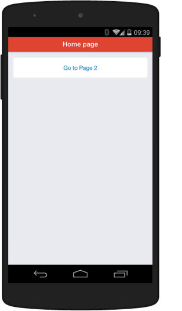

Kik Starter Kit
==========

[Live Demo](http://testdrive.kik.com/?app=starter-kit)

Starter Kit contains the necessary foundations to get you started on building Kik apps. 



### Local Setup

  1. Install Node.js (v0.8+) from [http://nodejs.org/](http://nodejs.org/)
  2. From the command line, run these commands:

    ```sh
    git clone git://github.com/kikinteractive/starter-kit.git
    cd starter-kit
    npm install
    ```


### Run debug server

1. Run this command: `npm start`
2. Go to [localhost:5000](http://localhost:5000/) in your browser to see your app


### Kik Developer Resources

All developer resources can be found on [dev.kik.com](http://dev.kik.com/).


### Copyright and License

Code released under the MIT license. Code and documentation copyright 2014 Kik Interactive, Inc.
